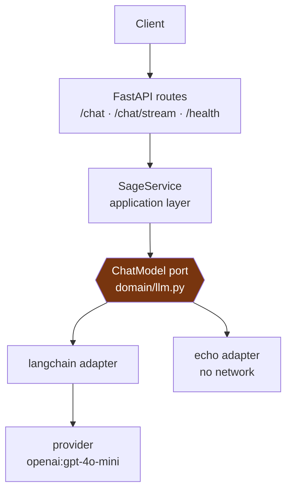

# Sage

An AI assistant built one mechanism at a time, to find out what actually breaks between a prompt
that works in a notebook and a system that answers real users.

Today it answers as a support agent for Pebble, a fictional gadget store — in one response, or
streamed as the model produces it. It also does something most chat interfaces deliberately hide:

```bash
uv run poe logprobs "Do you ship to Berlin?"
```

That prints the top five candidates for the **first token of the answer**, each with its
probability and a bar, plus how much of the total probability mass those five cover.

A language model never *chooses* a word. At every step it scores every token it knows, normalises
those scores into a distribution, and samples one. That sentence is easy to read and easy to keep
not quite believing — so Sage renders the distribution instead of describing it. Ask something
factual, then something open-ended, and watch how the spread changes.

**Python 3.12 · FastAPI · LangChain (swappable) · uv · mypy strict**

---

## Architecture



The amber box is the seam. [`domain/llm.py`](src/sage/domain/llm.py) imports nothing from
LangChain, OpenAI or FastAPI, and never will — everything above it depends on the `ChatModel`
protocol alone. That buys two different switches, both cheap:

- **New provider** (OpenAI → Anthropic): a config change.
- **New framework** (LangChain → anything else): one class with a `complete` method, one line in
  the factory. Nothing above the port moves.

---

## The decisions worth reading

**The domain speaks in dataclasses, the API speaks in pydantic.** `domain.Message` and
`api.ChatMessage` look like duplicates and are deliberately not merged. The wire model is public,
distrusts its input, and carries length limits; changing it breaks clients. The domain model is
internal, built by our own code from values already validated at the edge, and free to change any
time. Merging them would turn every internal refactor into a breaking API change, and put pydantic
in the domain. They share vocabulary, not structure — which is why `Role` has exactly one home and
the API imports it inward.

**Log-probabilities are a separate protocol, not part of the port.** `SupportsTokenChoices` sits
beside `ChatModel` rather than inside it, because the `echo` backend has no distribution and some
providers never return one. Folding it into the core port would force every adapter to implement
or fake the capability — which is precisely how a small port turns into a big one. Callers ask
`isinstance(model, SupportsTokenChoices)` and degrade politely when the answer is no.

**`stream` is a plain `def` returning an iterator, not an `async def`.** The service hands back the
model's own iterator instead of wrapping it in a second generator, so an `LLMError` surfaces while
the caller is iterating rather than when the call is made.

**SSE frames carry JSON, not raw text.** Server-Sent Events separate frames with newlines, and a
model chunk can contain one. Sending the text bare means a newline inside an answer silently breaks
the framing; JSON escapes it.

**A streaming failure cannot be a 502.** By the time the model fails mid-stream, a 200 and its
headers are already on the wire, and a status code cannot be recalled. So the error is caught
inside the generator and emitted as an `error` event — and a client must treat that as a failure
even though HTTP said OK. The non-streaming endpoint keeps the ordinary 502.

**Adapters translate their SDK's errors into `LLMError`.** The API layer never imports `openai` to
handle a failure, and swapping providers doesn't touch error handling anywhere above the port.

**`echo` is the default backend.** The app runs, the tests pass, and CI is green with no API key
and no network. Tests drive the real service against a fake model rather than mocking HTTP — the
seam exists precisely so that's possible.

---

## Running it

[uv](https://docs.astral.sh/uv/) is the only prerequisite; it installs Python itself.

```bash
uv sync                    # venv + deps from uv.lock
uv run pre-commit install
cp .env.example .env       # optional — every setting has a default
uv run poe dev             # http://127.0.0.1:8000  (interactive docs at /docs)
```

| Command | Does |
|---|---|
| `uv run poe dev` / `start` | Dev server with reload / production server |
| `uv run poe test` / `test-cov` | 23 tests / with coverage |
| `uv run poe typecheck` | mypy, strict |
| `uv run poe logprobs "…"` | Print the first-token distribution |
| `uv run poe check` | Everything CI runs |

### Endpoints

| Method | Path | Does |
|---|---|---|
| `POST` | `/chat` | One question, one answer |
| `POST` | `/chat/stream` | Same, streamed as SSE — `delta` events, then `done` or `error` |
| `GET` | `/health` | Liveness |

### Backends

Settings are environment variables prefixed `SAGE_` — see [`config.py`](src/sage/config.py).

| `SAGE_LLM_BACKEND` | Needs a key | Log-probs |
|---|---|---|
| `echo` *(default)* | no | no |
| `langchain` | yes | yes |

`SAGE_LLM_MODEL` defaults to `openai:gpt-4o-mini`. The API key is held as a `SecretStr`, so it
can't be printed by accident.

---

## Build log

Sage is built in public, roughly one mechanism per pull request. This list is the honest state of
it — what's here, and what isn't yet.

**Landed**

- Python/FastAPI scaffold — ruff, mypy strict, pytest, pre-commit, CI
- Pluggable LLM backend behind a domain port, with an `echo` adapter that needs no network
- Answers streamed over Server-Sent Events
- First-token probability distribution exposed as a CLI

**Next, roughly in order**

- Conversation memory — the API answers one question at a time and forgets it immediately
- Retrieval: chunking, embeddings, a vector store, answers grounded in real documents
- Evaluation — a way to tell whether a change made answers *better* rather than merely different
- Tracing, plus cost and latency accounted per request
- Guardrails and prompt-injection defence, once retrieval starts pulling untrusted text into the
  prompt

---

## Scope — what is deliberately not here yet

Everything under "Next" above, plus no authentication, no persistence of any kind, no rate
limiting, and no notion of more than one user. Sage is a single-tenant playground for the
mechanisms; each of those arrives when the mechanism that needs it does.

## Licence

[MIT](LICENSE).
