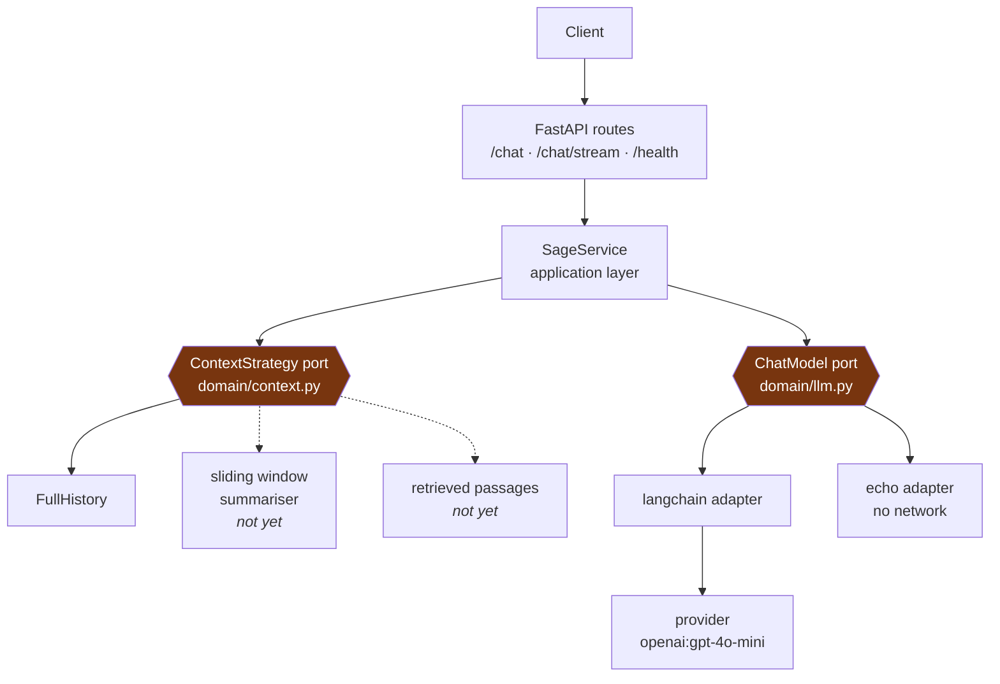

# Sage

An AI assistant built one mechanism at a time, to find out what actually breaks between a prompt
that works in a notebook and a system that answers real users.

Today it answers as a support agent for Pebble, a fictional gadget store — in one response, or
streamed as the model produces it, and across a conversation rather than one question at a time.
It also does something most chat interfaces deliberately hide:

```bash
uv run poe logprobs "Do you ship to Berlin?"
```

That prints the top five candidates for the **first token of the answer**, each with its
probability and a bar, plus how much of the total probability mass those five cover.

A language model never *chooses* a word. At every step it scores every token it knows, normalises
those scores into a distribution, and samples one. That sentence is easy to read and easy to keep
not quite believing — so Sage renders the distribution instead of describing it. Ask something
factual, then something open-ended, and watch how the spread changes.

**Python 3.12 · FastAPI · LangChain (swappable) · uv · mypy strict**

---

## Architecture



The amber boxes are the seams, and they cut in different directions:
[`domain/llm.py`](src/sage/domain/llm.py) abstracts **who answers**,
[`domain/context.py`](src/sage/domain/context.py) abstracts **what they are told**. Neither
imports LangChain, OpenAI or FastAPI, and neither ever will — everything above them depends on the
two protocols alone. That buys three switches, all cheap:

- **New provider** (OpenAI → Anthropic): a config change.
- **New framework** (LangChain → anything else): one class with a `complete` method, one line in
  the factory. Nothing above the port moves.
- **New context technique** (all of history → a window, a summary, retrieved passages): one class
  with a `select` method, one line in [`main.py`](src/sage/main.py). `SageService` never learns
  which one is running.

---

## The decisions worth reading

**What goes in the prompt is a strategy, not an `if`.** A prompt is three parts — the system
prompt, the context, the live question — and only the middle one is interesting. Today the context
is the whole conversation. Tomorrow it is the last eight turns, or a summary of the older ones, or
passages retrieved from Pebble's policy documents, or all three at once. Those differ enormously in
machinery and not at all in what the caller wants: some messages to put in front of the model. So
`SageService` asks `ContextStrategy` for messages and never learns which technique produced them,
exactly as it asks `ChatModel` for a reply and never learns which provider produced it. `FullHistory`
is the only implementation, and it is deliberately the *wrong* long-term answer — the prompt grows
without bound, so every turn re-pays for all the turns before it. It is here to be the baseline the
next strategy has to beat.

**The service owns the frame; the strategy owns the middle.** Instructions first, live question
last, always. A strategy cannot move either, which is why swapping one can change what the model
knows but never how the conversation is shaped. `Combined(SlidingWindow(8), Passages(store))` exists
because the techniques are not alternatives — a real assistant wants recent turns *and* retrieved
passages — and without a way to compose them, the second technique gets bolted onto the first and
the pair only knows how to be a pair.

**`select` is async, and returns messages nobody necessarily said.** Async because the interesting
implementations do I/O: a summariser calls a model, a retriever queries a vector store. `FullHistory`
awaits nothing and pays nothing for the shape. And the return type is `Sequence[Message]` rather
than "a subset of history", because a summary and a block of retrieved passages are both perfectly
good context that never appeared in the conversation.

**Sage holds no conversation state — the client replays the history.** No store, no session, no
conversation id, in a project that has no persistence and no notion of more than one user. The wire
type for a replayed turn allows `user` and `assistant` only: who Sage is belongs to the system
prompt, and leaving `system` out of the schema makes that ownership a fact rather than a rule
someone has to remember.

**The domain speaks in dataclasses, the API speaks in pydantic.** `domain.Message` and
`api.ChatMessage` look like duplicates and are deliberately not merged. The wire model is public,
distrusts its input, and carries length limits; changing it breaks clients. The domain model is
internal, built by our own code from values already validated at the edge, and free to change any
time. Merging them would turn every internal refactor into a breaking API change, and put pydantic
in the domain. They share vocabulary, not structure — which is why `Role` has exactly one home and
the API imports it inward.

**Log-probabilities are a separate protocol, not part of the port.** `SupportsTokenChoices` sits
beside `ChatModel` rather than inside it, because the `echo` backend has no distribution and some
providers never return one. Folding it into the core port would force every adapter to implement
or fake the capability — which is precisely how a small port turns into a big one. Callers ask
`isinstance(model, SupportsTokenChoices)` and degrade politely when the answer is no.

**Nothing wraps the model's stream in a second generator.** `ChatModel.stream` is a plain `def`
returning an iterator, and the service hands that same iterator straight back, so an `LLMError` from
the model surfaces while the caller is iterating rather than when the call is made. `ask_stream` did
have to become an `async def` once building the prompt could do I/O — a summarising or retrieving
strategy makes a call of its own — but it has no `yield` in it: awaiting it assembles the context and
returns the model's own stream untouched. Failures split where they should, with context assembly
raising at call time and the model raising mid-iteration.

**SSE frames carry JSON, not raw text.** Server-Sent Events separate frames with newlines, and a
model chunk can contain one. Sending the text bare means a newline inside an answer silently breaks
the framing; JSON escapes it.

**A streaming failure cannot be a 502.** By the time the model fails mid-stream, a 200 and its
headers are already on the wire, and a status code cannot be recalled. So the error is caught
inside the generator and emitted as an `error` event — and a client must treat that as a failure
even though HTTP said OK. The non-streaming endpoint keeps the ordinary 502.

**Adapters translate their SDK's errors into `LLMError`.** The API layer never imports `openai` to
handle a failure, and swapping providers doesn't touch error handling anywhere above the port.

**`echo` is the default backend.** The app runs, the tests pass, and CI is green with no API key
and no network. Tests drive the real service against a fake model rather than mocking HTTP — the
seam exists precisely so that's possible.

---

## Running it

[uv](https://docs.astral.sh/uv/) is the only prerequisite; it installs Python itself.

```bash
uv sync                    # venv + deps from uv.lock
uv run pre-commit install
cp .env.example .env       # optional — every setting has a default
uv run poe dev             # http://127.0.0.1:8000  (interactive docs at /docs)
```

| Command | Does |
|---|---|
| `uv run poe dev` / `start` | Dev server with reload / production server |
| `uv run poe test` / `test-cov` | 35 tests / with coverage |
| `uv run poe typecheck` | mypy, strict |
| `uv run poe logprobs "…"` | Print the first-token distribution |
| `uv run poe check` | Everything CI runs |

### Endpoints

| Method | Path | Does |
|---|---|---|
| `POST` | `/chat` | One question, one answer |
| `POST` | `/chat/stream` | Same, streamed as SSE — `delta` events, then `done` or `error` |
| `GET` | `/health` | Liveness |

Both chat endpoints take an optional `history`, oldest turn first, which is how a conversation
continues. It defaults to empty, so a client that only asks one-off questions sends what it always
did.

```bash
curl -s localhost:8000/chat -H 'content-type: application/json' -d '{
  "question": "and to Berlin?",
  "history": [
    {"role": "user",      "content": "do you ship to Paris?"},
    {"role": "assistant", "content": "We do, in 3-5 business days."}
  ]
}'
```

Roles in `history` are `user` and `assistant`; `system` is the server's to set. At most 100 turns,
which is a crude stand-in for the token budget that arrives with the strategy that needs one.

### Backends

Settings are environment variables prefixed `SAGE_` — see [`config.py`](src/sage/config.py).

| `SAGE_LLM_BACKEND` | Needs a key | Log-probs |
|---|---|---|
| `echo` *(default)* | no | no |
| `langchain` | yes | yes |

`SAGE_LLM_MODEL` defaults to `openai:gpt-4o-mini`. The API key is held as a `SecretStr`, so it
can't be printed by accident.

---

## Build log

Sage is built in public, roughly one mechanism per pull request. This list is the honest state of
it — what's here, and what isn't yet.

**Landed**

- Python/FastAPI scaffold — ruff, mypy strict, pytest, pre-commit, CI
- Pluggable LLM backend behind a domain port, with an `echo` adapter that needs no network
- Answers streamed over Server-Sent Events
- First-token probability distribution exposed as a CLI
- Multi-turn conversations, with what enters the prompt chosen behind a second port

**Next, roughly in order**

- A context strategy that isn't `FullHistory` — a sliding window, then summarising the turns it
  drops. The port is in place; both are a class each
- Retrieval: chunking, embeddings, a vector store, answers grounded in real documents. Arrives as a
  strategy beside the others, composed with `Combined`
- Evaluation — a way to tell whether a change made answers *better* rather than merely different
- Tracing, plus cost and latency accounted per request
- Guardrails and prompt-injection defence, once retrieval starts pulling untrusted text into the
  prompt

---

## Scope — what is deliberately not here yet

Everything under "Next" above, plus no authentication, no persistence of any kind, no rate
limiting, and no notion of more than one user. Conversations are multi-turn but not *stored* —
the client keeps the history and replays it, so there is no session and no conversation id. Sage is
a single-tenant playground for the mechanisms; each of those arrives when the mechanism that needs
it does.

## Licence

[MIT](LICENSE).
