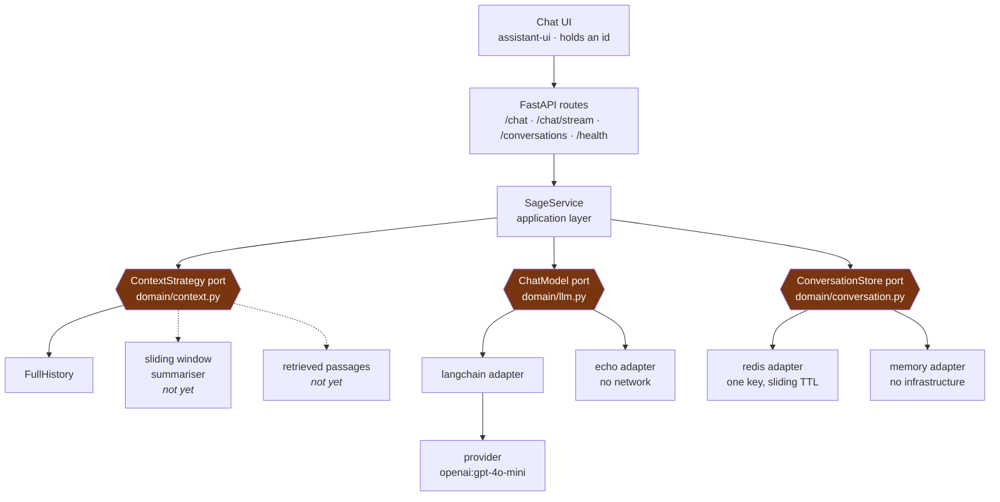

# Sage

An AI assistant built one mechanism at a time, to find out what actually breaks between a prompt
that works in a notebook and a system that answers real users.

Today it answers as a support agent for Pebble, a fictional gadget store — in one response, or
streamed as the model produces it, and across a conversation rather than one question at a time.
It also does something most chat interfaces deliberately hide:

```bash
uv run poe logprobs "Do you ship to Berlin?"
```

That prints the top five candidates for the **first token of the answer**, each with its
probability and a bar, plus how much of the total probability mass those five cover.

A language model never *chooses* a word. At every step it scores every token it knows, normalises
those scores into a distribution, and samples one. That sentence is easy to read and easy to keep
not quite believing — so Sage renders the distribution instead of describing it. Ask something
factual, then something open-ended, and watch how the spread changes.

**Python 3.12 · FastAPI · LangChain (swappable) · uv · mypy strict**

---

## Architecture


```mermaid
flowchart TB
    UI["Chat UI<br/>assistant-ui · holds an id"] --> API["FastAPI routes<br/>/chat · /chat/stream · /conversations · /health"]
    API --> SVC["SageService<br/>application layer"]

    SVC --> CTX{{"ContextStrategy port<br/>domain/context.py"}}
    CTX --> FH["FullHistory"]
    CTX -.-> SW["sliding window<br/>summariser<br/><i>not yet</i>"]
    CTX -.-> RP["retrieved passages<br/><i>not yet</i>"]

    SVC --> PORT{{"ChatModel port<br/>domain/llm.py"}}
    PORT --> LC["langchain adapter"]
    PORT --> EC["echo adapter<br/>no network"]
    LC --> P["provider<br/>openai:gpt-4o-mini"]

    SVC --> STORE{{"ConversationStore port<br/>domain/conversation.py"}}
    STORE --> RD["redis adapter<br/>one key, sliding TTL"]
    STORE --> MEM["memory adapter<br/>no infrastructure"]

    style PORT fill:#78350f,color:#fff
    style CTX fill:#78350f,color:#fff
    style STORE fill:#78350f,color:#fff
```

The amber boxes are the seams, and they cut in three different directions:
[`domain/llm.py`](src/sage/domain/llm.py) abstracts **who answers**,
[`domain/context.py`](src/sage/domain/context.py) abstracts **what they are told**, and
[`domain/conversation.py`](src/sage/domain/conversation.py) abstracts **what is remembered**. None
of them imports LangChain, OpenAI, Redis or FastAPI, and none ever will — everything above depends
on the three protocols alone. That buys four switches, all cheap:

- **New provider** (OpenAI → Anthropic): a config change.
- **New framework** (LangChain → anything else): one class with a `complete` method, one line in
  the factory. Nothing above the port moves.
- **New context technique** (all of history → a window, a summary, retrieved passages): one class
  with a `select` method, one line in [`main.py`](src/sage/main.py). `SageService` never learns
  which one is running.
- **New conversation store** (Redis → Postgres, or nothing at all): one class with `load` and
  `append`. The in-memory one exists so the app and the whole test suite run with no
  infrastructure, the same bargain `echo` makes for the model.

---

## The decisions worth reading

**What goes in the prompt is a strategy, not an `if`.** A prompt is three parts — the system
prompt, the context, the live question — and only the middle one is interesting. Today the context
is the whole conversation. Tomorrow it is the last eight turns, or a summary of the older ones, or
passages retrieved from Pebble's policy documents, or all three at once. Those differ enormously in
machinery and not at all in what the caller wants: some messages to put in front of the model. So
`SageService` asks `ContextStrategy` for messages and never learns which technique produced them,
exactly as it asks `ChatModel` for a reply and never learns which provider produced it. `FullHistory`
is the only implementation, and it is deliberately the *wrong* long-term answer — the prompt grows
without bound, so every turn re-pays for all the turns before it. It is here to be the baseline the
next strategy has to beat.

**The service owns the frame; the strategy owns the middle.** Instructions first, live question
last, always. A strategy cannot move either, which is why swapping one can change what the model
knows but never how the conversation is shaped. `Combined(SlidingWindow(8), Passages(store))` exists
because the techniques are not alternatives — a real assistant wants recent turns *and* retrieved
passages — and without a way to compose them, the second technique gets bolted onto the first and
the pair only knows how to be a pair.

**`select` is async, and returns messages nobody necessarily said.** Async because the interesting
implementations do I/O: a summariser calls a model, a retriever queries a vector store. `FullHistory`
awaits nothing and pays nothing for the shape. And the return type is `Sequence[Message]` rather
than "a subset of history", because a summary and a block of retrieved passages are both perfectly
good context that never appeared in the conversation.

**The client holds an id; Sage holds the turns.** The client cannot claim the assistant said
something it did not, because the client is not the one holding what was said. That is the whole
reason conversations moved server-side — it closes a prompt-injection route that a replayed history
leaves wide open. It does *not* buy privacy: an id with no auth is a bearer token with no ownership
check, and anyone holding one can read that conversation. Unguessability is doing the work here
(122 random bits), and only auth would do the rest.

**An unknown id is replaced, never adopted.** Sage mints ids; a client that sends one Sage does not
recognise gets a new conversation, not a conversation created under the id it chose. Honouring it
would hand id generation back to the client, which is the exact property server-minted ids exist to
remove — an incremental or low-entropy id from a careless client would be guessable, and Redis
cannot tell a CSPRNG from `Date.now()`. Randomness is the security property; server generation is
what makes it a property of the system rather than a hope about clients.

**Expiry measures silence, not age.** The TTL is rewritten on every exchange, so a conversation
dies a day after it was last used rather than a day after it began. Without that, a long
conversation would be pulled out from under someone mid-sentence — the one moment it must not be.

**A conversation is stored only once an exchange completes**, both halves at once. A question
stored before its answer would be replayed on the next turn as though it had been answered; a
stream that dies half-way leaves nothing behind, because half an answer is not something to feed
back into a later prompt as though it were said.

**The domain speaks in dataclasses, the API speaks in pydantic.** `domain.Message` and
`api.ChatMessage` look like duplicates and are deliberately not merged. The wire model is public,
distrusts its input, and carries length limits; changing it breaks clients. The domain model is
internal, built by our own code from values already validated at the edge, and free to change any
time. Merging them would turn every internal refactor into a breaking API change, and put pydantic
in the domain. They share vocabulary, not structure — which is why `Role` has exactly one home and
the API imports it inward.

**Log-probabilities are a separate protocol, not part of the port.** `SupportsTokenChoices` sits
beside `ChatModel` rather than inside it, because the `echo` backend has no distribution and some
providers never return one. Folding it into the core port would force every adapter to implement
or fake the capability — which is precisely how a small port turns into a big one. Callers ask
`isinstance(model, SupportsTokenChoices)` and degrade politely when the answer is no.

**The streaming path wraps the model's iterator, and it did not always.** `ChatModel.stream` is
still a plain `def` returning an iterator, and for a long time the service handed that same iterator
straight back — no extra frame, `LLMError` surfacing while the caller iterated. Storing conversations
ended that: an exchange is not finished until the last chunk lands, and something has to be there to
notice and write it down. So `ask_stream` now returns `(conversation, iterator)` and the iterator is
one of ours, accumulating pieces and persisting after the final one.

What the wrapper does *not* change is where failures appear. An `LLMError` still surfaces
mid-iteration rather than at the call, and a stream that dies part-way is never stored — half an
answer is not something to replay into a later prompt as though it had been said. The conversation
comes back before the iterator because the caller must tell the client which conversation this is
*before* the text arrives; if the id expired, that is news the client needs at the top of the reply,
not after it.

**SSE frames carry JSON, not raw text.** Server-Sent Events separate frames with newlines, and a
model chunk can contain one. Sending the text bare means a newline inside an answer silently breaks
the framing; JSON escapes it.

**A streaming failure cannot be a 502.** By the time the model fails mid-stream, a 200 and its
headers are already on the wire, and a status code cannot be recalled. So the error is caught
inside the generator and emitted as an `error` event — and a client must treat that as a failure
even though HTTP said OK. The non-streaming endpoint keeps the ordinary 502.

**Adapters translate their SDK's errors into `LLMError`.** The API layer never imports `openai` to
handle a failure, and swapping providers doesn't touch error handling anywhere above the port.

**`echo` is the default backend.** The app runs, the tests pass, and CI is green with no API key
and no network. Tests drive the real service against a fake model rather than mocking HTTP — the
seam exists precisely so that's possible.

---

## Running it

[uv](https://docs.astral.sh/uv/) is the only prerequisite; it installs Python itself.

```bash
uv sync                    # venv + deps from uv.lock
uv run pre-commit install
cp .env.example .env       # optional — every setting has a default
uv run poe dev             # http://127.0.0.1:8000  (interactive docs at /docs)
```

### The whole thing

`poe dev` runs the API alone. To bring up everything — API and Redis in Docker, chat UI on the host
— you need Docker Desktop running and the frontend's dependencies installed once:

```bash
npm --prefix frontend install
uv run poe up              # UI on :5173, API on :8000, Redis on :6379
```

Ctrl-C stops the frontend; the containers keep running until `uv run poe down`.

The frontend deliberately isn't a compose service. It runs on the host under Vite so hot reload and
the `/chat` proxy behave normally, and so the containers hold only the things that will one day be
deployed.

Compose sets `SAGE_CONVERSATION_STORE=redis`. Outside Docker the default is `memory`, so the app
and the test suite run with no infrastructure at all — the same bargain the `echo` backend makes.

It keeps its append-only log in a named volume, so `poe down` and a rebuild both leave the data
alone — expiring and surviving are different things, and conversations want both: gone after their
TTL, still there after a restart. `docker compose down -v` is the deliberate way to wipe it.

| Command | Does |
|---|---|
| `uv run poe up` | Docker (API + Redis), then the frontend dev server |
| `uv run poe up-api` | Docker only, logs in the foreground |
| `uv run poe frontend` | Frontend dev server alone |
| `uv run poe down` | Stop the containers |
| `uv run poe dev` / `start` | Dev server with reload / production server |
| `uv run poe test` / `test-cov` | 52 tests / with coverage |
| `uv run poe typecheck` | mypy, strict |
| `uv run poe logprobs "…"` | Print the first-token distribution |
| `uv run poe check` | Everything CI runs |

### Endpoints

| Method | Path | Does |
|---|---|---|
| `POST` | `/chat` | One question, one answer |
| `POST` | `/chat/stream` | Same, streamed as SSE — `conversation`, then `delta`s, then `done` or `error` |
| `GET` | `/conversations/{id}` | The turns stored under an id, or 404 |
| `GET` | `/health` | Liveness |

A conversation is continued by sending back the id, not the turns. Sage holds the turns.

```bash
# First question — no id yet.
curl -s localhost:8000/chat -H 'content-type: application/json' \
  -d '{"question": "do you ship to Paris?"}'
# {"reply": {...}, "conversation_id": "301ad5cd-…", "conversation_restarted": false}

# Second question — same conversation.
curl -s localhost:8000/chat -H 'content-type: application/json' \
  -d '{"question": "and to Berlin?", "conversation_id": "301ad5cd-…"}'
```

`conversation_id` comes back on every response, and it is authoritative even when it differs from
what was sent. An id Sage does not recognise — expired, evicted, or invented — gets a new
conversation and `conversation_restarted: true`, never an adoption of the id offered.

`/chat/stream` says the same thing in a `conversation` event, sent **before** any `delta`: a client
whose conversation just expired needs that before the answer arrives, not after.

### Backends

Settings are environment variables prefixed `SAGE_` — see [`config.py`](src/sage/config.py).

| `SAGE_LLM_BACKEND` | Needs a key | Log-probs |
|---|---|---|
| `echo` *(default)* | no | no |
| `langchain` | yes | yes |

`SAGE_LLM_MODEL` defaults to `openai:gpt-4o-mini`. The API key is held as a `SecretStr`, so it
can't be printed by accident.

---

## Build log

Sage is built in public, roughly one mechanism per pull request. This list is the honest state of
it — what's here, and what isn't yet.

**Landed**

- Python/FastAPI scaffold — ruff, mypy strict, pytest, pre-commit, CI
- Pluggable LLM backend behind a domain port, with an `echo` adapter that needs no network
- Answers streamed over Server-Sent Events
- First-token probability distribution exposed as a CLI
- Multi-turn conversations, with what enters the prompt chosen behind a second port
- A chat UI on [assistant-ui](frontend/), talking to the streaming endpoint
- Docker Compose for the API and Redis
- Conversations kept server-side behind a third port, addressed by an id the client stores

**Next, roughly in order**

- A context strategy that isn't `FullHistory` — a sliding window, then summarising the turns it
  drops. The port is in place; both are a class each
- Retrieval: chunking, embeddings, a vector store, answers grounded in real documents. Arrives as a
  strategy beside the others, composed with `Combined`
- Evaluation — a way to tell whether a change made answers *better* rather than merely different
- Tracing, plus cost and latency accounted per request
- Guardrails and prompt-injection defence, once retrieval starts pulling untrusted text into the
  prompt

---

## Scope — what is deliberately not here yet

Everything under "Next" above, plus no authentication, no rate limiting, and no notion of more
than one user. Conversations are stored, but anyone holding an id can read the conversation it
names — there is no ownership check, because there is nobody to own anything yet. Sage is a
single-tenant playground for the mechanisms; each of those arrives when the mechanism that needs it
does.

## Licence

[MIT](LICENSE).
